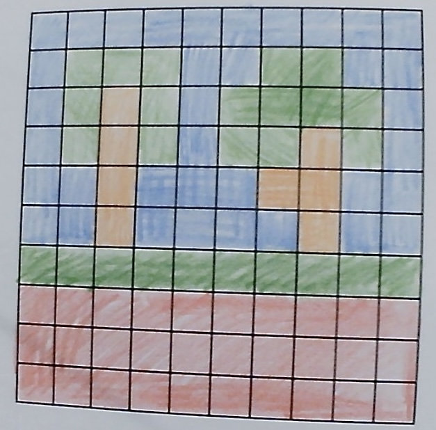
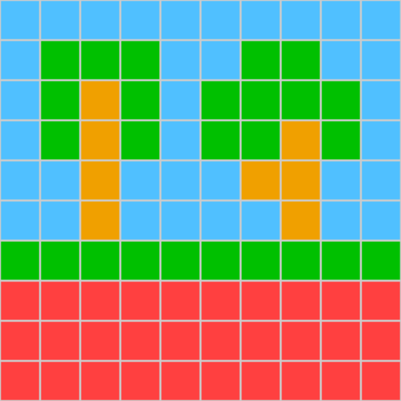

# Images w/hexadecimal

0A
0A
18
50C0FF 50C0FF 50C0FF 50C0FF 50C0FF 50C0FF 50C0FF 50C0FF 50C0FF 50C0FF
50C0FF 00C000 00C000 00C000 50C0FF 50C0FF 00C000 00C000 50C0FF 50C0FF
50C0FF 00C000 F0A000 00C000 50C0FF 00C000 00C000 00C000 00C000 50C0FF
50C0FF 00C000 F0A000 00C000 50C0FF 00C000 00C000 F0A000 00C000 50C0FF
50C0FF 50C0FF F0A000 50C0FF 50C0FF 50C0FF F0A000 F0A000 50C0FF 50C0FF
50C0FF 50C0FF F0A000 50C0FF 50C0FF 50C0FF 50C0FF F0A000 50C0FF 50C0FF
00C000 00C000 00C000 00C000 00C000 00C000 00C000 00C000 00C000 00C000
FF4040 FF4040 FF4040 FF4040 FF4040 FF4040 FF4040 FF4040 FF4040 FF4040
FF4040 FF4040 FF4040 FF4040 FF4040 FF4040 FF4040 FF4040 FF4040 FF4040
FF4040 FF4040 FF4040 FF4040 FF4040 FF4040 FF4040 FF4040 FF4040 FF4040
