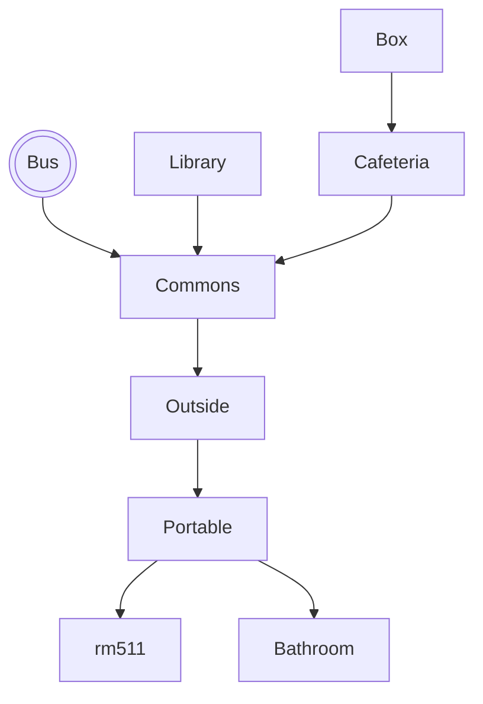

# Find The Floof

## Setting

This game takes place in a mirror neighborhood of my own. I kept the rough layout of my neighborhood, but changed street names around and made a few things closer together/farther apart.

## Map

The player starts in the House, and is then provided with options about what to do/where to go. The end goal is the cul de sac past Dogwood Park, but there are plenty of decoys along the way--so the play must work to find the right path!

## Story

The game starts after the player's front door blew open and their dog ran out. They must investigate a noise coming from a shortcut that leads to their neighbor's driveway. Going to this driveway makes `kids` true, and gives the player access to interactions with neighbor kids that allow them to win the game. 

## Global Variables

The most important variables are
`kids` and `haveFloof`, which are both
booleans that are vital to  the
story. Depending on `kids`,
some locations will display different situations and prompts. For example, if you go to the corner of Fourth St & Nettle Ln without the having gone through the shortcut, it won't provide an important interaction. Instead, it will lead you on a bit of a goose chase until you reach Dogwood Park, then it will really hint to go back and take the shortcut/check out that area. If you go to the corner of Fourth St & Nettle Ln, having gone through the shortcut, it will provide you with an opportunity to have an important interaction. This interaction leads you in the right direction to win the game---which flips `haveFloof from false to true. The player will never see the variables directly, but they are still very important to the game. 