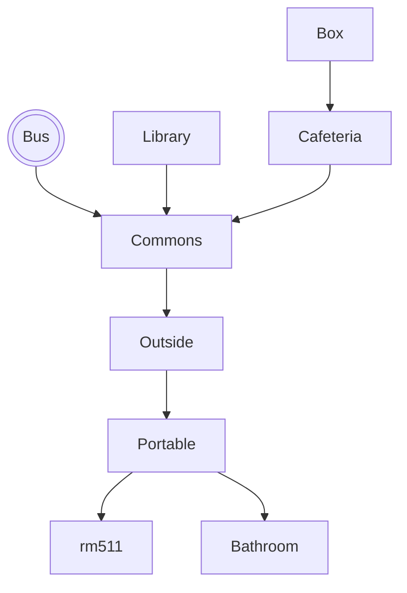

# Find The Floof

## Setting

This game takes place in a mirror neighborhood of my own. I kept the rough layout of my neighborhood, but changed street names around and made a few things closer together/farther apart.

## Map

The player starts in the House, and is then provided with options about what to do/where to go. The end goal is the cul de sac past Dogwood Park, but there are plenty of decoys along the way--so the play must work to find the right path!

## Story

When the user gets to rm511, they learn that the teacher is asleep.
They must take the teacher's coffee mug to the library, get it 
filled, and then bring it back to the teacher.

The game starts 15 minutes before the morning class bell, and each
move costs 1 minute. So this journey must be completed in 15 moves.
Some moves (like reading a book in the library) cost extra time.

## Global Variables

The most important variables are
`kids` and `cupIsFull`, both
booleans that track progress in the
story. Depending on these two variables,
some rooms will display different things. For example, if you walk into the
library without the cup, it will prompt you to
read. If you walk in with the cup, it will show
the librarian filling the cup with coffee.

I also have numeric variables called `day` and `minute` which keep track of 
time. `minute` starts at 0 and counts up
with each move.

I have a little HUD map, and use a bunch of 
boolean variables to control which
rooms the player has discovered. A map is only displayed after the user
visits it.